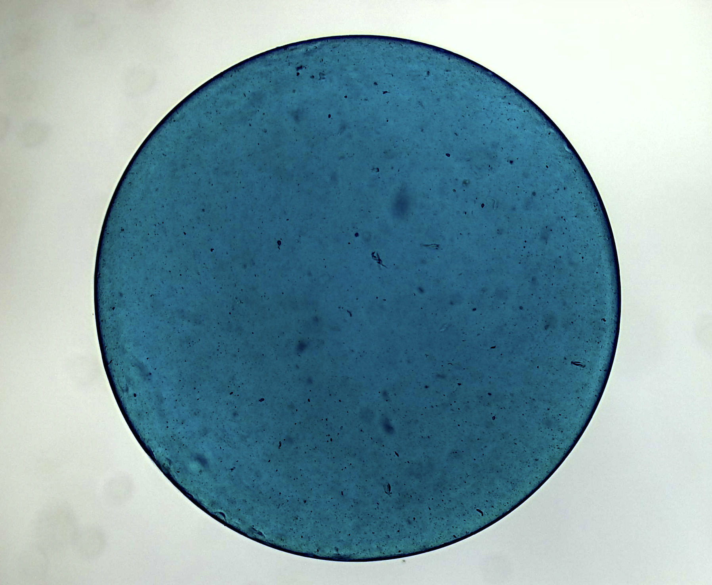
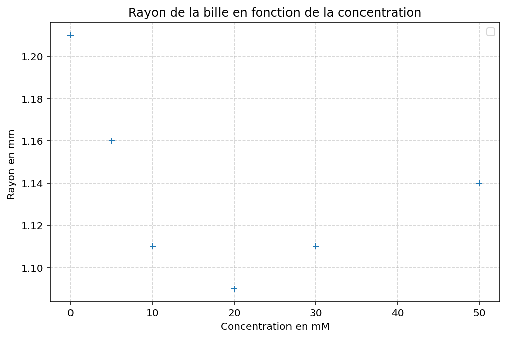
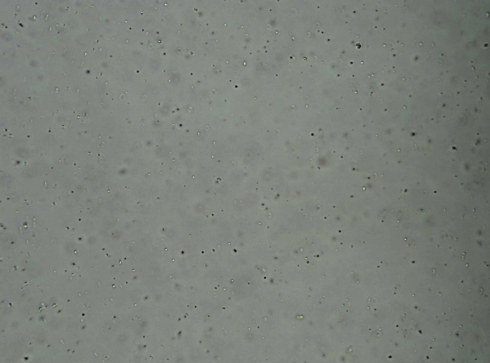
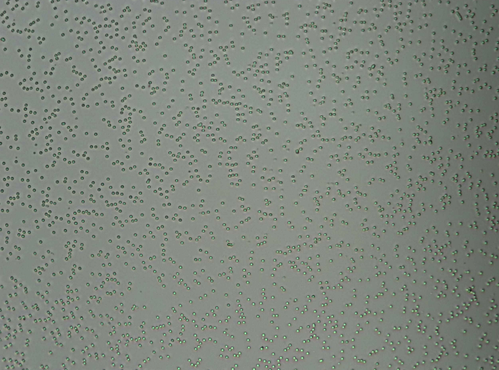
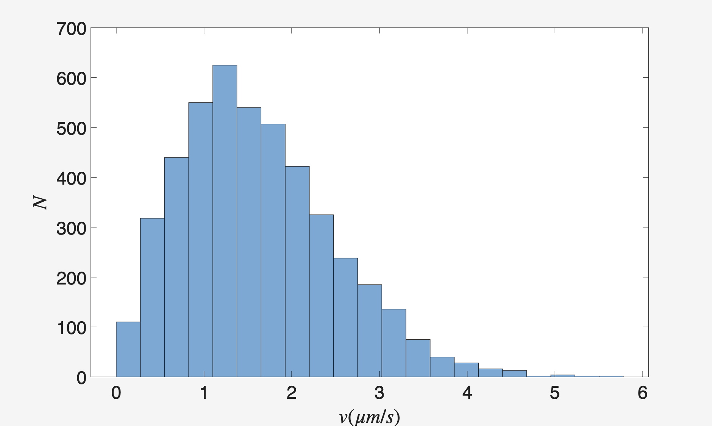
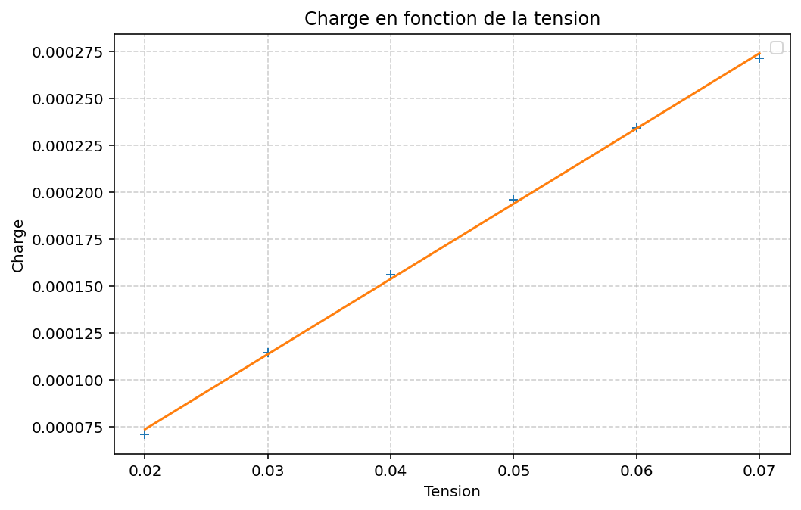
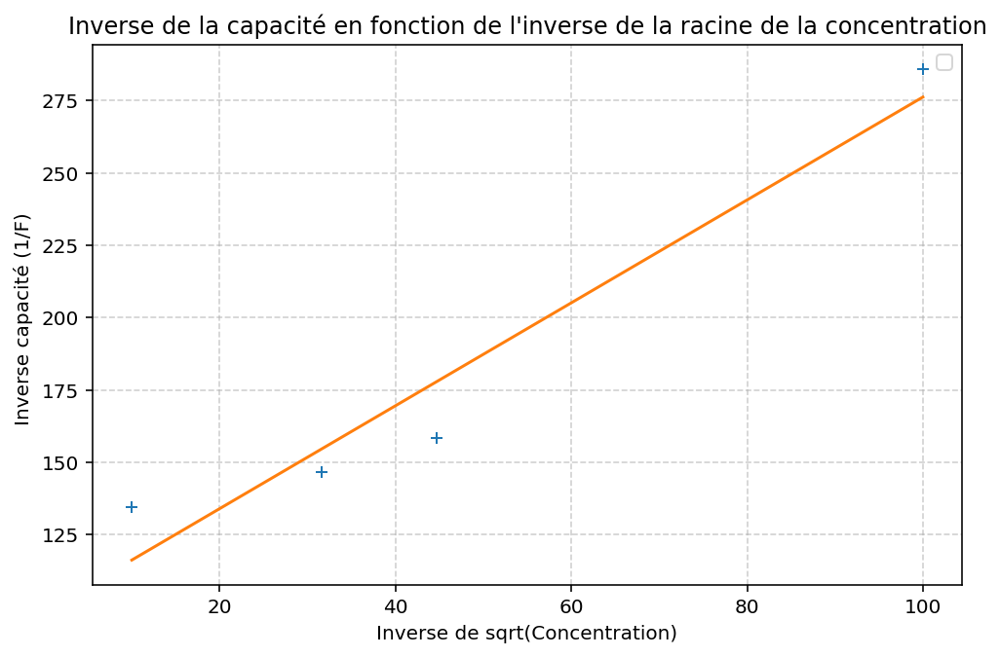

# TP Physique Statistique Appliquée — Solutions, dispersions et hydrogel

Elias Bonnefoi — ESPCI Paris PSL, 1ère année (2025-2026)
Binôme : Félix Clavier (Parties A & B), Maxime Rimbaud (Partie C)

Ce TP étudie trois systèmes modèles de complexité croissante en physique statistique des
solutions : le gonflement osmotique d'un hydrogel, la diffusion brownienne de colloïdes, et
la double couche électrique à une interface chargée. Chaque partie est un dossier
indépendant, organisé selon la même convention : `Python/` (scripts d'analyse), `Data/`
(données mesurées) et `Images/` (figures produites) — voir la structure ci-dessous.

## Structure du dépôt

```
├── rapport.pdf                          compte-rendu complet (22 pages)
├── figures_rapport/                     quelques figures clés extraites du rapport (voir ci-dessous)
│
├── partie_A_gonflement_hydrogel/        gonflement osmotique de billes d'alginate
│   ├── notes.txt                        vue d'ensemble de la partie
│   ├── Python/                          plot concentration calcium.py, plot concentration temps.py, untitled1.py
│   ├── Images/                          graphiques de synthèse (toutes conditions confondues)
│   └── Data/                            une mesure par condition (Results.csv + notes.txt),
│                                         + suivi temporel de la synérèse
│
├── partie_B_diffusion_colloides/        mouvement brownien de colloïdes
│   ├── notes.txt                        vue d'ensemble de la partie
│   └── Data/                            observations microscope, tracking de particules
│                                         (_spots.csv, .fig, .sfit), profil de concentration
│
└── partie_C_double_couche_electrique/   double couche électrique graphite/électrolyte
    ├── notes.txt                        vue d'ensemble de la partie
    ├── Python/                          plot capacite vs concentration.py
    └── Images/                          charge_vs_tension.png, capacite_vs_concentration.png
```

Chaque dossier et sous-dossier contient un `notes.txt` qui explique son contenu et la
notation des données (colonnes des `.csv`, unités, provenance des mesures).

---

## Partie A — Gonflement osmotique d'un hydrogel

Des billes d'alginate de sodium sont formées par gélification ionique : une goutte de
solution d'alginate tombe dans un bain de CaCl₂, où les ions Ca²⁺ (divalents) créent des
ponts entre les chaînes de polysaccharide ("egg-box model") et figent un réseau réticulé.
Une fois formées, les billes sont mises à l'équilibre dans des bains de concentration
croissante en Ca²⁺ (0 à 50 mM). À l'équilibre thermodynamique, le potentiel chimique de
l'eau est le même de part et d'autre de la membrane du gel, ce qui impose une pression
osmotique totale nulle :

```
Π = Π_mix + Π_el + Π_ion = 0
```

où `Π_mix` est liée à l'énergie de mélange polymère/solvant, `Π_el` à l'élasticité entropique
du réseau réticulé, et `Π_ion` à la différence de concentration ionique entre l'intérieur et
l'extérieur du gel (effet Donnan).



*Photographie au microscope (x4) d'une bille d'alginate après 1h dans une solution de CaCl₂ à 10 mM.*

Le résultat principal est que le rayon des billes n'évolue pas de façon monotone avec la
concentration en Ca²⁺ : il décroît jusqu'à une **concentration critique d'environ 20 mM**
(le réseau se réticule davantage, donc se contracte), puis ré-augmente aux concentrations
plus fortes.



*Rayon des billes d'alginate en fonction de la concentration en CaCl₂ (0 à 50 mM).*

La synérèse (expulsion spontanée d'eau par un gel trop réticulé) est également suivie au
cours du temps pour une bille dans CaCl₂ à 50 mM, et modélisée par une décroissance
exponentielle `R(t) = a·exp(-bt) + c`, ce qui permet d'extraire un temps caractéristique
d'expulsion de l'eau.

## Partie B — Diffusion de colloïdes

Des colloïdes de silice (5 µm) et de latex (1,5 µm) sont observés au microscope pour étudier
leur mouvement brownien, provoqué par l'agitation thermique du solvant.




*Observations préliminaires au microscope : colloïdes de latex (gauche) et de silice (droite).
La silice apparaît plus dense sur ce plan focal, du fait de sa masse volumique différente de
celle du latex (le profil vertical de concentration suit une loi barométrique).*

Le diamètre caractéristique du régime colloïdal est retrouvé en égalant l'énergie
d'agitation thermique `k_BT` à l'énergie potentielle de pesanteur apparente sur une échelle
égale à la taille de la particule, ce qui donne `d ≈ 0,9 µm` — cohérent avec les tailles
observées expérimentalement (1 à 5 µm).

En trackant les particules image par image (TrackMate), on obtient la distribution des
vitesses et des déplacements élémentaires :



*Distribution des vitesses instantanées mesurées sur les trajectoires trackées (petit ROI, 1000 images).*

Le coefficient de diffusion mesuré, `D = (8,12 ± 0,8) × 10⁻¹³ m²/s`, est du même ordre de
grandeur que la prédiction de Stokes-Einstein (`4,77 × 10⁻¹³ m²/s`) — un écart caractérisé
par un z-score de 4,2, qui révèle des sources d'incertitude expérimentales non négligeables
(bruit de détection, dérive de mise au point, taille finie de l'échantillon de trajectoires)
plutôt qu'une invalidation du modèle.

## Partie C — Double couche électrique

Un assemblage de plaques de graphite est immergé dans une solution de NaCl. Le contact entre
le graphite chargé et l'électrolyte crée une redistribution des ions au voisinage de
l'interface (la "double couche électrique"), modélisée par deux capacités en série : la
couche de Stern (ions collés à l'électrode) et la couche diffuse de Gouy-Chapman.

La chrono-ampérométrie (mesure du courant après un échelon de tension) donne accès à la
charge accumulée, et donc à la capacité du système par régression linéaire de la charge en
fonction de la tension imposée :



*Charge accumulée en fonction de la tension imposée — la pente donne la capacité `C = 4,01 mF`.*

En répétant la mesure à différentes concentrations ioniques, la théorie de Gouy-Chapman
prédit que l'inverse de la capacité varie linéairement avec l'inverse de la racine de la
concentration (`1/C ∝ 1/√c₀`), ce qui permet d'extraire la **longueur de Debye** `λ_D` du
système :



*Inverse de la capacité en fonction de l'inverse de la racine de la concentration ionique
(rapport Fig. 16) : points expérimentaux et régression linéaire.*

La pente mesurée (1,77 F⁻¹·M^(1/2)) est du même ordre de grandeur que la valeur théorique
(0,71 F⁻¹·M^(1/2)), ce qui valide qualitativement le modèle. L'écart quantitatif est attribué
à deux approximations du modèle simple : la capacité totale mesurée inclut aussi celles du
graphite et de la couche de Stern (négligées devant celle de Gouy-Chapman dans le calcul
théorique), et l'hypothèse de "potentiel faible" (`eV ≪ k_BT`) n'est pas toujours respectée
avec une tension de test de 10 mV.

---

## Remarque sur les données

Les images brutes de microscopie (~1700 fichiers `.tiff`, ~660 Mo) ne sont **pas incluses**
dans ce dépôt (trop volumineuses pour git). Seuls le code d'analyse, les données extraites
(`Results.csv`, `_spots.csv`) et les figures produites sont versionnés — voir le `notes.txt`
de chaque dossier concerné.

## Dépendances

```bash
pip install numpy matplotlib scipy
```
